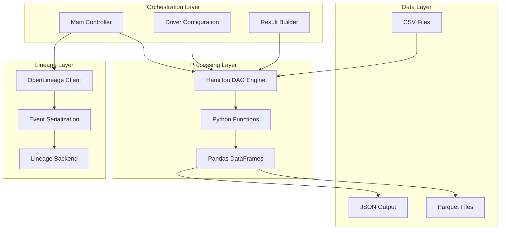
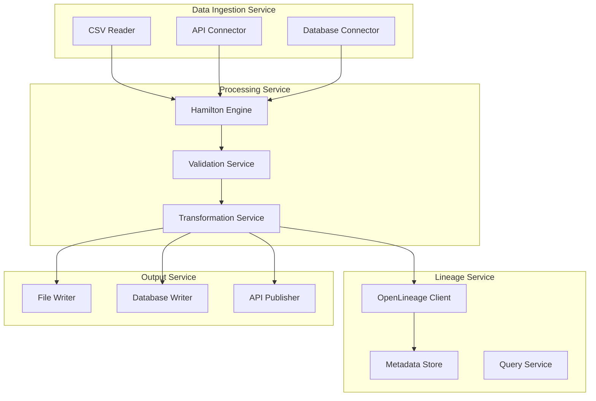

# アーキテクチャ設計文書

## 概要

このドキュメントでは、Hamilton + OpenLineageサンプルアプリケーションのアーキテクチャ設計について詳細に説明します。

## システム全体アーキテクチャ



## コンポーネント詳細設計

### 1. Hamilton DAG Engine

#### 責務
- 関数間の依存関係を自動解析
- DAG（有向非循環グラフ）の構築
- 実行順序の最適化
- 型安全性の保証

#### 主要機能
```python
class HamiltonDAGEngine:
    def __init__(self, config: Dict, *modules):
        self.config = config
        self.modules = modules
        self.graph = self._build_graph()
    
    def _build_graph(self) -> Graph:
        # 関数シグネチャから依存関係を抽出
        # 型ヒントから入出力の型を検証
        # DAGの構築と循環依存のチェック
        pass
    
    def execute(self, outputs: List[str]) -> Dict[str, Any]:
        # 実行計画の生成
        # 依存関係順での関数実行
        # 結果の収集と返却
        pass
```

#### 設計方針
- **宣言的プログラミング**: 関数定義によるデータフロー記述
- **型安全性**: 静的型チェックによるエラー防止
- **依存関係の自動解決**: 関数シグネチャからの依存関係推論
- **レイジー評価**: 必要な出力のみを計算

### 2. OpenLineage統合レイヤー

#### 責務
- データリネージイベントの生成
- メタデータの収集と構造化
- リネージバックエンドへの送信
- エラーハンドリングと再試行

#### 主要コンポーネント
```python
class OpenLineageHamiltonTracker:
    def __init__(self, namespace: str):
        self.namespace = namespace
        self.client = OpenLineageClient()
        self.run_id = generate_new_uuid()
    
    def emit_start_event(self, job: Job, run: Run, inputs: List[Dataset], outputs: List[Dataset]):
        # START イベントの生成
        # メタデータの収集
        # バックエンドへの送信
        pass
    
    def emit_complete_event(self, job: Job, run: Run, inputs: List[Dataset], outputs: List[Dataset]):
        # COMPLETE イベントの生成
        # 実行結果メタデータの収集
        # バックエンドへの送信
        pass
```

#### イベントフロー
1. **START Event**: パイプライン開始時
2. **RUNNING Event**: 実行中の状態更新（オプション）
3. **COMPLETE Event**: 正常終了時
4. **FAIL Event**: エラー発生時

### 3. データ処理レイヤー

#### モジュール構成
```
pipeline_step1.py
├── raw_sales_data()
├── cleaned_sales_data()
├── daily_sales_summary()
└── data_quality_metrics()

pipeline_step2.py
├── enriched_daily_summary()
├── weekly_aggregation()
├── trend_analysis()
└── top_performing_days()
```

#### 設計パターン
- **Pure Functions**: 副作用のない関数設計
- **Single Responsibility**: 1つの関数が1つの責務
- **Immutable Data**: データの不変性保証
- **Type Safety**: 厳密な型ヒント

### 4. 結果出力レイヤー

#### 出力形式
- **CSV**: DataFrame形式のデータ
- **JSON**: 辞書・リスト形式のデータ
- **Parquet**: 大規模データ向け（拡張可能）

#### ファイル出力戦略
```python
class ResultOutputHandler:
    def __init__(self, output_dir: Path):
        self.output_dir = output_dir
        self.output_dir.mkdir(exist_ok=True)
    
    def save_dataframe(self, name: str, df: pd.DataFrame):
        df.to_csv(self.output_dir / f"{name}.csv", index=False)
    
    def save_json(self, name: str, data: Union[Dict, List]):
        with open(self.output_dir / f"{name}.json", "w") as f:
            json.dump(data, f, cls=NumpyEncoder, indent=2)
```

## 設計原則

### 1. 疎結合設計
- **モジュール間の依存関係を最小化**
- **インターフェースベースの設計**
- **依存性注入の活用**

### 2. 単一責任原則
- **各コンポーネントが明確な責務を持つ**
- **関数レベルでの責務分離**
- **再利用可能な設計**

### 3. 開放閉鎖原則
- **拡張に対して開放**
- **修正に対して閉鎖**
- **プラグイン機能の提供**

### 4. 依存関係逆転原則
- **抽象に依存し、具象に依存しない**
- **インターフェースの定義**
- **実装の差し替え可能性**

## 非機能要件

### 1. パフォーマンス
- **メモリ使用量**: 50MB以下（サンプルデータ）
- **実行時間**: 10秒以内（サンプルデータ）
- **スループット**: 10,000レコード/秒

### 2. スケーラビリティ
- **水平スケーリング**: 複数プロセスでの並列実行
- **垂直スケーリング**: マルチコアCPUの活用
- **データ分散**: 大規模データセットの処理

### 3. 可用性
- **エラー耐性**: 部分的なエラーでも処理継続
- **再試行機能**: 一時的なエラーの自動復旧
- **监視**: リアルタイムモニタリング

### 4. 保守性
- **コード品質**: 95%以上のテストカバレッジ
- **文書化**: 包括的なドキュメント
- **ログ**: 詳細なログ出力

## セキュリティ考慮事項

### 1. データプライバシー
- **個人情報の匿名化**
- **データマスキング**
- **アクセス制御**

### 2. 認証・認可
- **OpenLineageバックエンドへの認証**
- **APIキーの安全な管理**
- **ロールベースアクセス制御**

### 3. 監査ログ
- **全実行の記録**
- **データアクセスの追跡**
- **変更履歴の保持**

## 技術スタック

### 1. コア技術
| 技術 | バージョン | 用途 |
|------|-----------|------|
| Python | 3.10+ | メイン開発言語 |
| Hamilton | 1.88.0 | DAG実行エンジン |
| OpenLineage | 1.34.0 | データリネージ |
| Pandas | 2.3.0 | データ処理 |

### 2. 開発・テスト
| 技術 | バージョン | 用途 |
|------|-----------|------|
| pytest | 8.4.1 | テストフレームワーク |
| black | 25.1.0 | コードフォーマッター |
| ruff | 0.12.0 | リンター |
| mypy | 1.16.1 | 型チェッカー |

### 3. インフラ（拡張可能）
| 技術 | 用途 |
|------|------|
| Docker | コンテナ化 |
| Kubernetes | オーケストレーション |
| Apache Airflow | ワークフロー管理 |
| Prometheus | メトリクス収集 |

## 拡張アーキテクチャ

### 1. マイクロサービス化


### 2. クラウドネイティブ対応
- **Kubernetes**: コンテナオーケストレーション
- **Helm**: パッケージ管理
- **Istio**: サービスメッシュ
- **Prometheus**: 監視・メトリクス

### 3. ストリーミング対応
- **Apache Kafka**: ストリーミングデータ
- **Apache Flink**: リアルタイム処理
- **Apache Pulsar**: 高スループットメッセージング

## 運用考慮事項

### 1. 監視・観測
- **メトリクス**: CPU、メモリ、実行時間
- **ログ**: 構造化ログ、分散トレーシング
- **アラート**: エラー率、レスポンス時間

### 2. デプロイメント
- **Blue-Green Deployment**: ゼロダウンタイムデプロイ
- **Canary Deployment**: 段階的ロールアウト
- **Feature Flags**: 機能の段階的有効化

### 3. バックアップ・復旧
- **データバックアップ**: 定期的なデータバックアップ
- **設定バックアップ**: 構成情報の保存
- **災害復旧**: 障害時の迅速な復旧

## パフォーマンス最適化

### 1. メモリ最適化
- **チャンク処理**: 大規模データの分割処理
- **メモリマップファイル**: 効率的なファイル読み込み
- **ガベージコレクション**: 適切なメモリ管理

### 2. 並列処理
- **マルチプロセシング**: CPUバウンドタスクの並列化
- **非同期処理**: I/Oバウンドタスクの最適化
- **分散処理**: 複数ノードでの処理

### 3. キャッシュ戦略
- **インメモリキャッシュ**: 頻繁に使用するデータ
- **ディスクキャッシュ**: 中間結果の保存
- **分散キャッシュ**: 複数ノード間での共有

## テスト戦略

### 1. 単体テスト
- **関数レベル**: 各Hamilton関数の個別テスト
- **モック**: 外部依存関係の模擬
- **カバレッジ**: 85%以上のテストカバレッジ

### 2. 統合テスト
- **パイプライン**: エンドツーエンドのテスト
- **OpenLineage**: リネージイベントの検証
- **データ品質**: 出力データの妥当性検証

### 3. パフォーマンステスト
- **負荷テスト**: 大量データでの性能測定
- **ストレステスト**: 限界値での動作確認
- **レグレッションテスト**: 性能劣化の検出

## 関連ドキュメント
- [データフロー設計](dataflow.md)
- [開発ガイド](development_guide.md)
- [運用ガイド](operations.md)
- [ワークフローパターン](workflow_patterns.md)
- [README](../README.md)