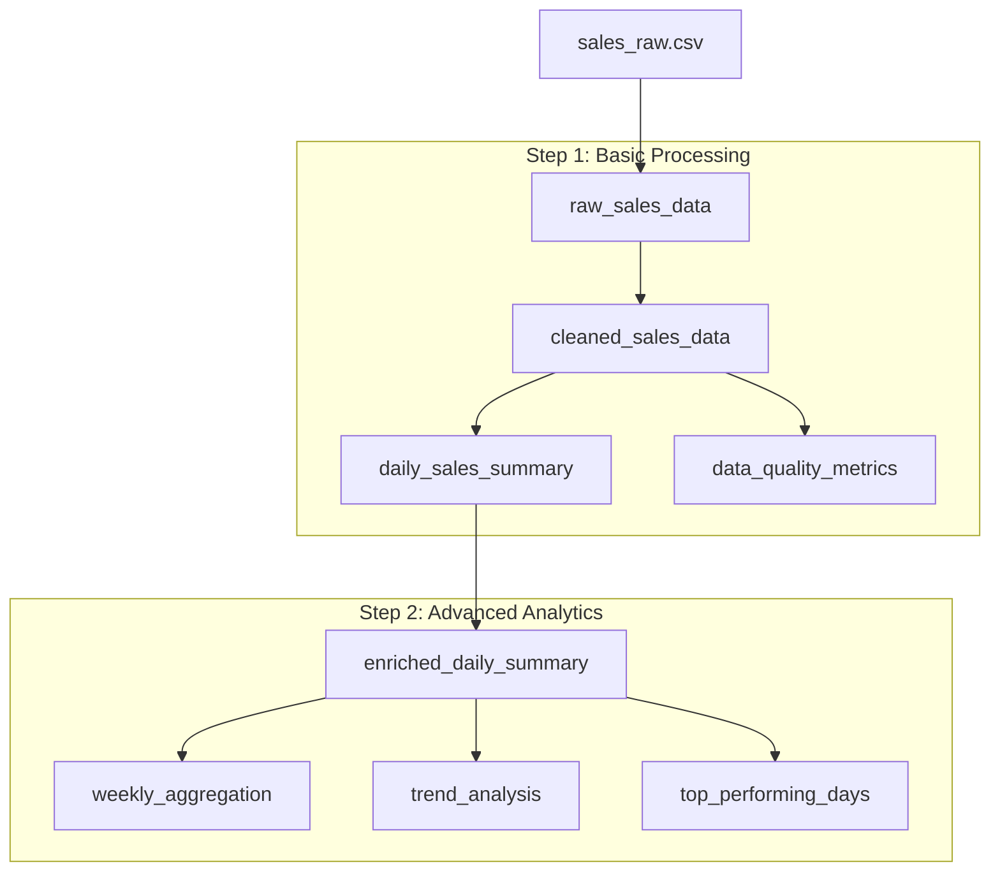

# データフロー設計文書

## 概要

このドキュメントでは、Hamilton + OpenLineageサンプルアプリケーションのデータフローと変換ロジックについて説明します。

## データフロー全体像



## データ変換ステップ

### Phase 1: データ取得・前処理

#### 1.1 raw_sales_data
**目的**: 生の売上データを読み込む  
**入力**: `data/sales_raw.csv`  
**出力**: DataFrame (生データ)  
**処理内容**: CSVファイルからデータを読み込み

**データスキーマ**:
| カラム名 | データ型 | 説明 | 制約 |
|---------|---------|------|------|
| date | string | 売上日 | YYYY-MM-DD形式 |
| product_id | string | 商品ID | 英数字 |
| amount | float | 売上金額 | 数値 |
| customer_id | string | 顧客ID | 英数字 |

#### 1.2 cleaned_sales_data
**目的**: データクリーニングを実行  
**入力**: 生の売上データ  
**出力**: クリーニング済みデータ  
**処理内容**:
1. 欠損値（NaN）を持つレコードを除去
2. 売上金額が0以下のレコードを除去
3. 日付カラムをdatetime型に変換

**データ品質ルール**:
- `amount > 0`: 正の売上金額のみ
- `date IS NOT NULL`: 日付が存在
- `product_id IS NOT NULL`: 商品IDが存在

#### 1.3 daily_sales_summary
**目的**: 日別売上サマリーを作成  
**入力**: クリーニング済みデータ  
**出力**: 日別集計データ  
**処理内容**:
1. 日付でグループ化
2. 売上金額の合計・平均・件数を計算
3. ユニーク商品数を計算

**出力スキーマ**:
| カラム名 | データ型 | 説明 |
|---------|---------|------|
| date | datetime | 売上日 |
| total_amount | float | 日別売上合計 |
| avg_amount | float | 日別売上平均 |
| transaction_count | int | 取引件数 |
| unique_products | int | ユニーク商品数 |

#### 1.4 data_quality_metrics
**目的**: データ品質メトリクスを計算  
**入力**: 生データ、クリーニング済みデータ  
**出力**: データ品質指標辞書  
**処理内容**:
1. レコード数の比較
2. データロス率の計算
3. 重複・欠損値の統計

**出力メトリクス**:
- `raw_record_count`: 生データレコード数
- `cleaned_record_count`: クリーニング後レコード数
- `data_loss_rate`: データロス率（%）
- `null_count`: 欠損値総数
- `duplicate_count`: 重複レコード数

### Phase 2: 高度な分析・集計

#### 2.1 enriched_daily_summary
**目的**: 日別サマリーにトレンド情報を追加  
**入力**: 日別売上サマリー  
**出力**: 拡張された日別サマリー  
**処理内容**:
1. 7日移動平均の計算
2. 前日比変化率の計算
3. 曜日情報の追加
4. 週末フラグの設定

**追加カラム**:
| カラム名 | データ型 | 説明 |
|---------|---------|------|
| total_amount_ma7 | float | 売上7日移動平均 |
| avg_amount_ma7 | float | 平均売上7日移動平均 |
| total_amount_change | float | 売上前日比変化率 |
| avg_amount_change | float | 平均売上前日比変化率 |
| day_of_week | string | 曜日名 |
| is_weekend | bool | 週末フラグ |

#### 2.2 weekly_aggregation
**目的**: 週別集計を作成  
**入力**: 拡張された日別サマリー  
**出力**: 週別集計データ  
**処理内容**:
1. 週単位でグループ化（ISO週）
2. 週別統計量の計算
3. 変動係数の算出

**出力スキーマ**:
| カラム名 | データ型 | 説明 |
|---------|---------|------|
| week | period | 週（YYYY-WW形式） |
| weekly_total | float | 週別売上合計 |
| daily_avg | float | 週内日平均売上 |
| daily_std | float | 週内日売上標準偏差 |
| weekly_transactions | int | 週別取引件数 |
| avg_unique_products | float | 週内平均ユニーク商品数 |
| weekend_days | int | 週末日数 |

#### 2.3 trend_analysis
**目的**: トレンド分析結果を計算  
**入力**: 拡張された日別サマリー  
**出力**: トレンド分析結果辞書  
**処理内容**:
1. 期間成長率の計算（最初の週 vs 最後の週）
2. 最高・最低売上日の特定
3. 平日・週末の売上比較
4. 売上のボラティリティ計算

**分析指標**:
- `period_growth_rate`: 期間成長率（%）
- `max_sales_amount`: 最高売上金額
- `max_sales_date`: 最高売上日
- `min_sales_amount`: 最低売上金額
- `min_sales_date`: 最低売上日
- `weekday_avg_sales`: 平日平均売上
- `weekend_avg_sales`: 週末平均売上
- `weekend_premium`: 週末プレミアム（%）
- `volatility`: 売上のボラティリティ（標準偏差）

#### 2.4 top_performing_days
**目的**: 売上上位日のリストを作成  
**入力**: 拡張された日別サマリー  
**出力**: 売上上位日のリスト（上位5日）  
**処理内容**:
1. 売上金額による降順ソート
2. 上位5日の抽出
3. 各日の詳細情報を辞書形式で出力

**出力フォーマット**:
```json
[
  {
    "date": "2024-01-13",
    "total_amount": 7750.25,
    "transaction_count": 3,
    "day_of_week": "Saturday",
    "is_weekend": true
  }
]
```

## データ変換ルール

### データ型変換
1. **日付**: 文字列 → datetime64
2. **金額**: float64（小数点以下2桁で丸め）
3. **カウント**: int64
4. **比率**: float64（小数点以下4桁で丸め）

### 欠損値処理
1. **基本方針**: 欠損値を含むレコードは除外
2. **例外**: 移動平均計算では`min_periods=1`を設定

### 外れ値処理
1. **売上金額**: 0以下の値は除外
2. **変化率**: 無限大値は除外（前日が0の場合）

## データ依存関係

### 直接依存
```
raw_sales_data → cleaned_sales_data → daily_sales_summary → enriched_daily_summary
```

### 分岐依存
```
enriched_daily_summary → [weekly_aggregation, trend_analysis, top_performing_days]
[raw_sales_data, cleaned_sales_data] → data_quality_metrics
```

### 循環依存の回避
- 各関数は純粋関数として設計
- 副作用のない実装
- 明示的な依存関係のみ

## 関連ドキュメント
- [アーキテクチャ設計](architecture.md)
- [開発ガイド](development_guide.md)
- [運用ガイド](operations.md)
- [ワークフローパターン](workflow_patterns.md)
- [README](../README.md)